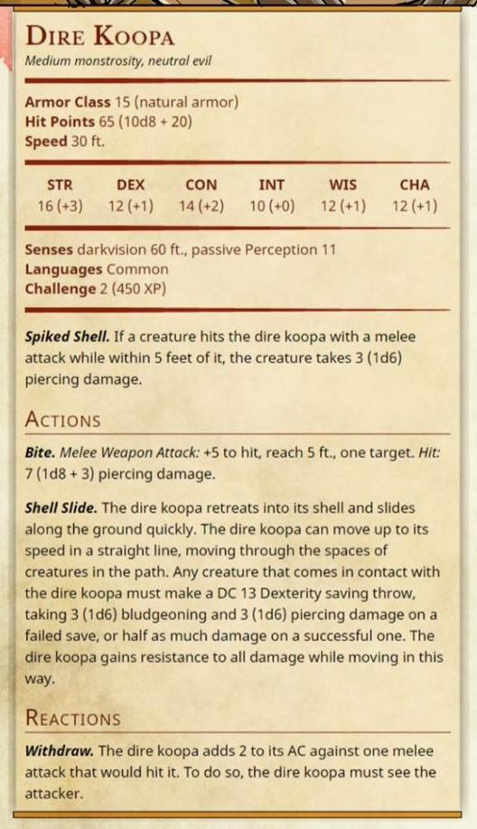

- [[Vorbereitung]]
	- Langtoft
	  collapsed:: true
		- you are a dungeon master in a dnd campaign. You have a party of 4 level 6 charters. The party approaches a fortress of earth benders in style of avatar last air bender. There are 4 earthbenders on the wall. The layout of the fortress is a wooden wall and a mountain on the other side. in the centre are tents. There is also the leader and a stone golem.
		  Give me a battle encounter. the difficulty should be very hard. describe hp, immunities (if any), resistances (if any) and vulnerabilities (if any), all possible actions of all monsters. design the battle in 2 stages use the fortress as an environment which has an impact onto the fight.
		- Here’s a fully fleshed-out **D&D battle encounter** for your level 6 party. This is designed to be a **very hard encounter** and uses the environment creatively. The battle is staged with escalating danger to keep things dynamic and tense.
		  
		  ---
		- ## **Encounter Overview:**
		- **Party Composition Assumptions:** 4 players, level 6. Expected to have a mix of melee, ranged, and spellcasters.
		- **Enemy Forces:**
			- **4 Earthbender Soldiers** on the walls.
			- **1 Earthbender Commander (Leader)** in the central area.
			- **1 Stone Golem** (mini-boss).
		- ### **Environment:**
		- **Wooden Walls:** 20 feet high, easy for Earthbenders to manipulate. The Earthbenders can create cracks in the walls to destabilize them.
		- **Mountain Edge:** Players approaching from the open side are exposed to a slope where boulders can be rolled at them.
		- **Central Tents:** Limited visibility. Difficult terrain when destroyed (burned or toppled).
		- **Fortress Gates:** Reinforced wooden gates (AC 15, HP 40).
		  
		  ---
		- ## **Enemy Statblocks:**
		- ### **Earthbender Soldiers (5)**
		- **HP:** 40 each.
		- **AC:** 14 (natural armor).
		- **Speed:** 30 ft.
		- **Immunities:** Poison, being prone.
			- **Resistances:** Nonmagical bludgeoning, piercing, and slashing damage (unless adamantine).
		- #### **Actions:**
		- **Earth Slam (Melee):**
			- *Attack Roll:* +5 to hit, reach 5 ft.
			- *Damage:* 12 (2d8 + 3) bludgeoning.
		- **Boulder Toss (Ranged):**
			- *Attack Roll:* +5 to hit, range 60/120 ft.
			- *Damage:* 10 (2d6 + 3) bludgeoning.
			- **Special:** If the target is hit, they must make a DC 14 Strength saving throw or be knocked prone.
		- **Earth Wave (Recharge 5-6):**
			- *Effect:* All creatures in a 10-ft-wide, 30-ft-long line must make a DC 14 Dexterity saving throw. On a failure, they take 14 (3d6) bludgeoning damage and are knocked prone. Half damage on success.
		- #### **Tactics:**
		- Soldiers stay on the wall for ranged advantage and to maintain cover.
		- Use Earth Wave strategically to slow or disrupt players trying to breach the gates.
		  
		  ---
		- ### **Earthbender Commander (Leader)**
		- **HP:** 75.
		- **AC:** 16 (natural armor).
		- **Speed:** 30 ft.
		- **Immunities:** Poison, being restrained.
		- **Resistances:** Nonmagical bludgeoning, piercing, and slashing damage.
		- **Vulnerabilities:** Thunder damage.
		- #### **Actions:**
		- **Stone Spear (Melee or Ranged):**
			- *Attack Roll:* +6 to hit, reach 10 ft. or range 30 ft.
			- *Damage:* 15 (2d10 + 4) piercing.
		- **Raise Earth Barrier (Recharge 6):**
			- *Effect:* Creates a 10-ft-wide, 10-ft-high stone wall in an unoccupied space within 30 ft. The wall lasts 1 minute and provides full cover. (HP 20, AC 12.)
		- **Seismic Slam (Recharge 5-6):**
			- *Effect:* Each creature within 15 ft. must make a DC 15 Strength saving throw or take 18 (4d8) bludgeoning damage and be knocked back 10 ft. and prone. Half damage on success.
		- **Commander’s Rally (Bonus Action, 1/Encounter):**
			- *Effect:* All allied Earthbenders within 60 ft. gain advantage on their next attack roll and deal an additional 1d8 bludgeoning damage on a hit.
		- #### **Tactics:**
		- Uses Earth Barrier to block players from rushing the Stone Golem or protect ranged Earthbenders.
		- Prioritizes squishy or high-damage characters with Seismic Slam.
		- Buffs allies early in the fight with Commander’s Rally.
		  
		  ---
		- ### **Stone Golem (Mini-Boss)**
		- **HP:** 136.
		- **AC:** 17 (natural armor).
		- **Speed:** 30 ft.
		- **Immunities:** Poison, psychic, exhaustion, being knocked prone.
		- **Resistances:** Nonmagical bludgeoning, piercing, and slashing damage.
		- **Vulnerabilities:** Lightning damage.
		- #### **Actions:**
		- **Slam (Melee):**
			- *Attack Roll:* +8 to hit, reach 10 ft.
			- *Damage:* 19 (3d8 + 5) bludgeoning.
		- **Rock Throw (Ranged):**
			- *Attack Roll:* +8 to hit, range 60/120 ft.
			- *Damage:* 22 (4d8 + 5) bludgeoning.
		- **Earthquake Stomp (Recharge 5-6):**
			- *Effect:* All creatures within 20 ft. must make a DC 15 Dexterity saving throw. On a failure, they take 18 (4d8) bludgeoning damage and are knocked prone. On success, half damage.
		- **Stone Shield (Reaction, 1/Turn):**
			- When hit by an attack, the Golem can reduce damage taken by 10.
		- #### **Tactics:**
		- Prioritizes melee players or anyone getting too close to the Earthbender Commander.
		- Uses Earthquake Stomp to break up grouped players.
		- Takes cover behind barriers created by the Commander if necessary.
		  
		  ---
		- ## **Battle Stages:**
		- ### **Stage 1: The Wall Defense**
		- Players must break through the gates or scale the wooden walls.
		- **Environmental Hazards:**
			- **Boulders from the Mountain:** Earthbenders can dislodge boulders from the mountain, rolling them downhill. Each boulder is a 10-ft-wide obstacle. Any creature in its path must make a DC 14 Dexterity saving throw or take 14 (3d6) bludgeoning damage and be knocked prone.
			- **Cracking Walls:** Earthbenders can spend an action to collapse a portion of the wall, creating difficult terrain (15 ft. radius).
		- The **4 Earthbender Soldiers** provide ranged support and try to keep players at bay.
		  
		  ---
		- ### **Stage 2: The Commander and the Stone Golem**
		- Once the players breach the walls, the **Commander** and **Stone Golem** enter the fight. The Commander stays near the tents, using barriers to divide and conquer the party.
		- **Environmental Hazards:**
			- **Tents Catch Fire:** If players use fire spells or fire damage, tents may catch fire, filling a 10-ft radius with smoke. Creatures in the smoke are **blinded** unless they succeed on a DC 13 Constitution saving throw.
			- **Earth Spikes:** The Commander creates spike-filled areas (10-ft radius) as part of the Earth Wave, turning them into difficult terrain that deals 7 (2d6) piercing damage when crossed.
			  
			  The **Stone Golem** serves as the primary tank, soaking up damage while the Commander uses barriers and abilities to pick off vulnerable characters.
	- Mushroom Cave
	  collapsed:: true
		- **Kameks**
		  collapsed:: true
			- *Medium humanoid, neutral evil*
			  **Armor Class **14 (natural armor)
			  **Hit Points** 39 (6d8 + 12)
			  **Speed **30 ft., fly 50 ft. (hover) while riding a *broom of flying*
			  **STR **8 (-1) **DEX **14 (+2) **CON **14 (+2)
			  **INT **13 (+1) **WIS **14 (+2) **CHA **11 (+0)
			  **Skills **Arcana +4
			  **Senses **darkvision 60 ft., passive Perception 12
			  **Languages **Common, Draconic
			  **Challenge **3 (700 XP)
			- **ACTIONS**
			  **Bite.** Melee Weapon Attack: +1 to hit, reach 5 ft., one target. Hit: 2 (1d6 - 1) piercing damage.
			  **Magic Wand. **The kamek shoots up to two of the following 
			  magical rays at one or two creatures it can see within 60 feet of it. It
			   can use each ray only once on a turn. The magic wand does not function 
			  for non-kameks.
			- *Confusion Ray.* The target mus succeed 
			  on a DC 13 Wisdom saving throw, or it can't take reactions until the end
			  of its next turn. On its turn, the target can't move, and it uses its 
			  action to make a melee or ranged attack against a randomly determined 
			  creature within range. If the target can't attack, it does nothing on 
			  its turn.
			- *Paralyzing Ray.* The target must 
			  succeed on a DC 13 Constitution saving throw or be paralyzed for 1 
			  minute. The target can repeat the saving throw at the end of each of its
			  turns, ending the effect on itself on a success.
			- *Fear Ray. *The target must succeed on a
			  DC 13 Wisdom saving throw or be frightened for 1 minute. The target can
			  repeat the saving throw at the end of each of its turns, with 
			  disadvantage if the kamek is visible to the target, ending the effect on
			  itself on a success.
			- *Wounding Ray. *The target must make a 
			  DC 13 Constitution saving throw, taking 16 (3d10) necrotic damage on a 
			  failed save, or half as much damage on a successful one.
			  
			  **REACTIONS**
			  **Spell Reflection.** If the kamek makes a successful saving 
			  throw against a spell, or a spell attack misses it, the kamek can choose
			  another creature (including the spellcaster) it can see within 30 feet 
			  of it. The spell targets the chosen creature instead of the kamek. If 
			  the spell forced a saving throw, the chosen creature makes its own save.
			  If the spell was an attack, the attack roll is rerolled against the 
			  chosen creature.
			  
			  Kameks close to within 60 feet of the heroes, flying at all times, to 
			  try and harry them with ranged blasts from their magic wands. If a kamek
			  dies over solid ground, the characters can retrieve and immediately use
			  its broom of flying. If a kamek is killed over lava, its broom falls 
			  into the lava and is destroyed. If you want to step up the difficulty of
			  the challenge a bit further, you can have it where defeating Bowser 
			  before killing all the kameks causes Bowser to rise again as a 
			  dracoturtlich. (I leave that to you to stat up.)
		- **Pirahna Plants**
		  collapsed:: true
			- *Large plant, unaligned*
			- **Armor Class** 15 (natural armor)
			- **Hit Points** 136 (16d10 + 48)
			- **Speed **-
			- **STR** 18 (+4)** DEX** 8 (-1)** CON** 16 (+3)
			- **INT** 5 (-3) **WIS** 10 (+0)** CHA** 5 (-3)
			- **Skills **Stealth +2
			- **Damage Resistances **cold, lightning
			- **Damage Immunities **fire
			- **Condition Immunities **blinded, deafened, exhaustion
			- **Senses **blindsight 60 ft. (blind beyond this radius), passive Perception 10
			- **Languages **-
			- **Challenge **5 (1,800 XP)
			- **Fire Absorption.** Whenever the piranha plant is subjected 
			  to fire damage, it takes no damage and and hurls a mote of fire at a 
			  target of its choice within 60 feet as a reaction. The target must make a
			  DC 14 Dexterity saving throw or take fire damage equal to the amount of
			  fire damage to which the piranha plant was subjected. A successful save
			  reduces the damage by half.
			- **ACTIONS**
			- **Multiattack. **The piranha plant makes two bite attacks. If 
			  both attacks hit a Medium or smaller target, the target is grappled 
			  (escape DC 14), and the piranha plant uses its Engulf on it.
			- **Bite. **Melee Weapon Attack: +7 to hit, reach 5 ft., one target. Hit: 13 (2d8 + 4) piercing damage.
			- **Engulf.** The piranha plant engulfs a Medium or smaller 
			  creature grappled by it. The engulfed target is blinded, restrained, and
			  unable to breathe, and it must succeed on a DC 14 Constitution saving 
			  throw at the start of each of the pirahna plant's turns or take 13 (2d8 +
			  4) bludgeoning damage. If the piranha plant is moved, the engulfed 
			  target moves with it. The piranha plant can have only one creature 
			  engulfed at a time.
		- **Koopa**
		  collapsed:: true
			- 
		- ### **Goomba (CR 4 Monster for Dungeons & Dragons 5e)**
		  collapsed:: true
			- ---
			  
			  **Goomba**
			  *Small Monstrosity, Unaligned*
			  
			  **Armor Class** 16 (Natural Armor)
			  **Hit Points** 93 (11d6 + 44)
			  **Speed** 30 ft.
			  
			  | STR | DEX | CON | INT | WIS | CHA |
			  | ---- | ---- | ---- |
			  | 16 (+3) | 18 (+4) | 18 (+4) | 6 (-2) | 10 (+0) | 8 (-1) |
			  
			  **Saving Throws** Dex +7, Con +6
			  **Skills** Perception +3, Athletics +6
			  **Damage Resistances** Bludgeoning, Poison
			  **Condition Immunities** Prone
			  **Senses** Darkvision 60 ft., Passive Perception 13
			  **Languages** Understands Common but can't speak
			  
			  **Challenge** 4 (1,100 XP)
			  
			  ---
			- ### **Abilities**
			- #### **Flat-Headed**
			  
			  A Goomba cannot be knocked prone.
			- #### **Goomba Gang**
			  
			  Goombas work best in groups. While within 5 feet of at least one other Goomba, it has advantage on attack rolls.
			- #### **Super Jump (Recharge 4-6)**
			  
			  As a bonus action, the Goomba leaps up to 30 feet in any direction without provoking opportunity attacks. If it lands on a creature, that creature must make a **DC 15 Strength saving throw** or be knocked **prone** and take **9 (2d8) bludgeoning damage**.
			- #### **Hard-Headed Charge**
			  
			  If the Goomba moves at least 15 feet in a straight line before attacking, it deals an extra **2d6 bludgeoning damage** on its next attack.
			  
			  ---
			- ### **Actions**
			- #### **Headbutt.**   *Melee Weapon Attack:*  +7 to hit, reach 5 ft., one target.
			  
			  **Hit:** 14 (2d8 + 5) bludgeoning damage.
			- #### **Tackle (Recharge 5-6).**   *Melee Weapon Attack:*  +7 to hit, reach 5 ft., one target.
			  
			  **Hit:** 19 (3d10 + 3) bludgeoning damage, and the target must make a **DC 15 Strength saving throw** or be **pushed 10 feet** backward.
			- #### **Stomp Vulnerability (DM Rule):**
			  
			  If a creature **jumps** on the Goomba from above (falling at least 10 feet onto it), the Goomba must make a **DC 15 Constitution saving throw**. On a failure, the Goomba is instantly **defeated** (reduced to 0 HP). On a success, it takes **double damage** from the attack instead.
		- ### **Bowser, King of the Koopas (CR 5 Boss Monster)**
		  collapsed:: true
			- *Large Dragon, Lawful Evil*
			  
			  ---
			  
			  **Armor Class** 18 (Natural Armor)
			  **Hit Points** 136 (13d10+65)
			  **Speed** 40 ft.
			  
			  ---
			- ### **Abilities**
			  
			  | Ability | Score | Modifier |
			  | ---- | ---- | ---- |
			  | **STR** | 22 (+6) |  |
			  | **DEX** | 10 (+0) |  |
			  | **CON** | 20 (+5) |  |
			  | **INT** | 10 (+0) |  |
			  | **WIS** | 12 (+1) |  |
			  | **CHA** | 15 (+2) |  |
			  
			  ---
			- ### **Saving Throws**
			  
			  STR +9, CON +8, WIS +4
			- ### **Skills**
			  
			  Intimidation +5, Athletics +9
			- ### **Damage Resistances**
			  
			  Fire
			- ### **Damage Immunities**
			  
			  Poison
			- ### **Condition Immunities**
			  
			  Charmed, Frightened
			- ### **Senses**
			  
			  Darkvision 60 ft., Passive Perception 11
			- ### **Languages**
			  
			  Common, Draconic
			  
			  ---
			- ### **Traits**
			- #### **Thick Shell Armor.**
			  
			  Bowser's thick shell grants him resistance to all non-magical bludgeoning, piercing, and slashing damage.
			- #### **Fiery Rebirth.**
			  
			  If reduced to 0 hit points, Bowser erupts in flames and reappears at full health in his lair (or another location chosen by the DM) within 24 hours unless his body is destroyed by radiant damage.
			- #### **Legendary Toughness.**
			  
			  Bowser can ignore one instance of a critical hit per round, treating it as a normal hit.
			  
			  ---
			- ### **Actions**
			- #### **Multiattack.**
			  
			  Bowser makes two melee attacks: one Claw attack and one Bite attack.
			- #### **Claw.**   *Melee Weapon Attack:*  +9 to hit, reach 5 ft., one target.
			  
			  **Hit:** 14 (2d8 + 6) slashing damage.
			- #### **Bite.**   *Melee Weapon Attack:*  +9 to hit, reach 5 ft., one target.
			  
			  **Hit:** 16 (2d10 + 6) piercing damage.
			- #### **Flame Breath (Recharge 5-6).**
			  
			  Bowser exhales a massive cone of fire in a 30-foot cone. Each creature in the area must make a **DC 16 Dexterity saving throw**, taking **35 (10d6) fire damage** on a failed save, or half as much on a success.
			- #### **Shell Spin (Recharge 4-6).**
			  
			  Bowser retracts into his shell and spins rapidly in a 10-ft radius. All creatures in the area must make a **DC 16 Strength saving throw** or take **22 (4d8+6) bludgeoning damage** and be knocked prone. Bowser moves up to 30 feet during this attack and can pass through enemy spaces.
			  
			  ---
			- ### **Bonus Actions**
			- #### **Koopa King’s Roar (1/Day).**
			  
			  Bowser lets out a deafening roar. All enemies within 30 feet must make a **DC 14 Wisdom saving throw** or become **frightened** for 1 minute. A frightened target can repeat the save at the end of each of their turns.
			  
			  ---
			- ### **Legendary Actions (3/Turn)**
			  
			  Bowser can take **three** legendary actions per round, choosing from the options below. Only one can be used at a time, and only at the end of another creature’s turn.
			- **Claw Swipe.** Bowser makes a Claw attack.
			- **Shell Bash.** Bowser rams a creature within 5 feet, forcing them to make a **DC 14 Strength saving throw** or be pushed 10 feet back.
			- **Lair Leap (Costs 2 Actions).** Bowser leaps up to **20 feet** and lands with a powerful stomp. All creatures within 10 feet must make a **DC 15 Dexterity saving throw** or take **10 (3d6) bludgeoning damage** and be knocked prone.
			  
			  ---
			- ### **Lair Actions (Optional for Extra Challenge!)**
			  
			  If fought in his castle or a volcanic lair, Bowser gains the following lair actions:
			- **Lava Burst (Recharge 5-6).** Lava erupts from the ground in three locations, dealing **3d6 fire damage** to creatures within 5 feet of each burst.
			- **Falling Debris.** Chunks of stone fall from above, forcing all creatures in a **20-foot radius** to make a **DC 15 Dexterity saving throw** or take **2d10 bludgeoning damage** and be restrained until freed (DC 14 Strength check).
			  
			  ---
			- ### **Tactics**
			- Bowser starts combat **with his Koopa King’s Roar**, aiming to frighten as many enemies as possible.
			- He will use **Shell Spin** if multiple enemies are around him.
			- He favors **Flame Breath** against ranged attackers.
			- If reduced to half HP, he becomes more aggressive, using **Legendary Actions** to push enemies and reposition.
-