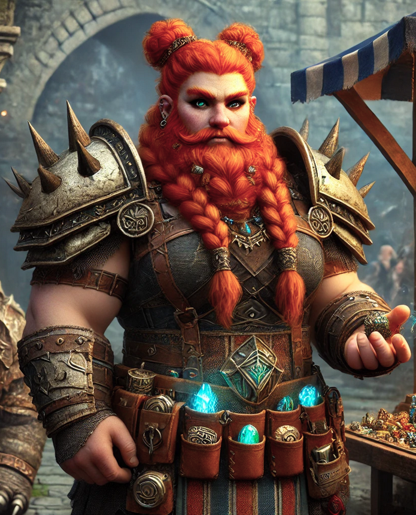

type:: [[NPC]]
in:: anywhere
icon:: 👤
description:: anything
status::

- **Name:** *Durga Bristlebraid*
  **Race:** Mountain Dwarf
  **Gender:** Female
  **Class:** Non-combatant (Artificer background, retired)
  **Age:** 134
  **Alignment:** Lawful Neutral
  **Personality Type:** **Choleric** – Ambitious, hot-headed, controlling, fiercely independent.
- {:height 455, :width 297}
- ### **Background:**
  
  Durga Bristlebraid once served as a **Runesmith-General** in the [[Emberguard War College]], designing magical siege engines and rune-bound wargear. After a *disastrous love affair* with an elven enchanter (whom she now only refers to as "Twigface"), she left the military, *disgusted with bureaucracy and heartache*, and set up a booming trade in rare magical artifacts.
  
  She now runs **"Bristlebraid's Bound Wonders"**, a mobile cart-shop reinforced with glyphs of warding, dragged by a heavily-armored dire badger named *Pinto*. Durga travels from city to city, **scowling at amateurs**, **barking prices**, and **inspecting wares with monocle-enhanced fury**.
  
  ---
- ### **Appearance:**
- **Height:** 4'6"
- **Build:** Stocky with a forge-tempered strength
- **Hair:** Fire-orange, braided into tight coils adorned with rune-etched copper beads
- **Beard:** Proud and plaited, tipped with small iron spikes (she uses it for intimidation)
- **Eyes:** Piercing emerald green
- **Voice:** Thunderous, gravelly, and barely-contained sarcasm
- **Clothing:** Reinforced leather apron with pockets filled with glinting curios. Armored corset made of repurposed dragonhide. Ever-smoking pipe clenched between teeth.
  
  ---
- ### **Quirks & Traits:**
- **Temper:** Short-fused. She once hexed a noble because he called her shop “quaint.”
- **Haggling Style:** Bark first, curse later, then offer a fair deal—but only if impressed.
- **Catchphrase:** *“By Moradin’s flaming anvil, do I look like a haggler or a fool?!”*
- **Secret Soft Spot:** Flute music. Makes her cry. Denies it vehemently.
- **Unique Item:** Wears an enchanted monocle that can *see through illusions and lies*, called **Truth-Eye of Halgrund**. Claims she won it in a card game with a ghost.
  
  ---
- ### **Inventory Example (rotates often):**
- **Whimwhistle Lantern** – Glows when nearby magic is unstable.
- **Gilded Jawbone of Veritas** – Lets the wielder speak *one perfect truth* per week.
- **Toad-Soul Ring** – Turns the wearer into a toad if they lie. Hilarious at parties.
- **Portable Hole-in-a-Mug** – Looks like a cracked stein. Actually holds a 10-ft pit inside.
- **The Pouting Mirror** – Shows you what your enemies *secretly* think about you.
  
  ---
- ### **Secrets:**
- **Common Secret (easily discoverable):** Durga was once engaged to a high elf noble, a union forbidden by both families. She hates talking about it—but it's *common tavern gossip*.
- **Hidden Secret (difficult to uncover):** One of the artifacts in her possession is an actual *phylactery*, disguised as a cursed music box. She doesn’t *know* what it is—yet.