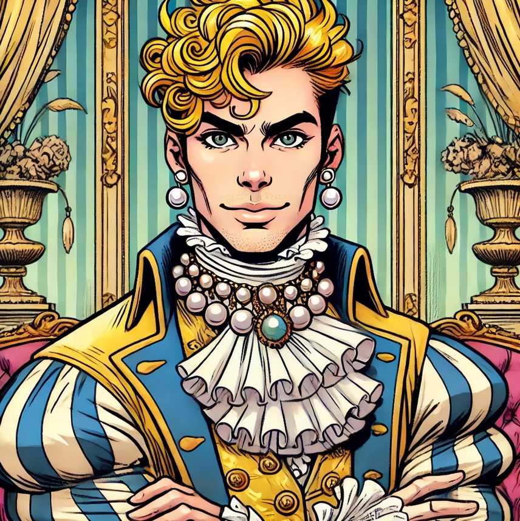

type:: [[NPC]]
in:: [[Langtoft]] 
icon:: 👤
description:: Graf von [[Langtoft]] 
status::

- **Persönlichkeit:**
	- Arrogant, aber unsicher
	- Will immer Eindruck schinden
	- Leichtgläubig und naiv
	- **Geheimnis:**
	  Er ist kein echter Adliger, sondern das Kind eines ehemaligen Dieners, das von der Familie vertauscht wurde, um die Erbfolge zu sichern.
	- **Motivation:**
	  Er will um jeden Preis die Anerkennung der "echten" Adligen und träumt davon, ein Held seiner Familie zu werden, um seinen Status zu festigen.
	- {:height 312, :width 292}