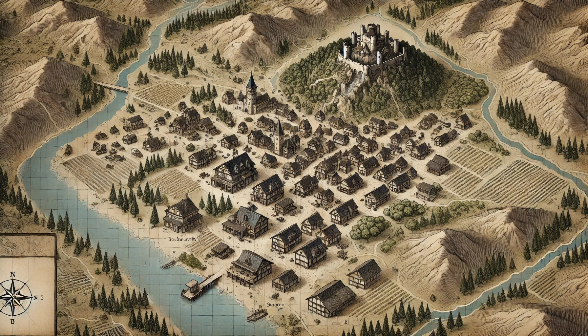

type:: [[town]]
icon:: 🏙️
domain:: [[Great Kingdom Neverwinter]] 
status::

- Details of this city:
	- Hatte mal eine Burg, ist aber nicht mehr besiedelt.
	- Generell hat das Dorf schon bessere Zeiten gesehen
- 
-
- query-table:: true
  query-properties::
  query-properties:: [:icon :page :description]
  #+BEGIN_QUERY
   {:title [:b "NPCs"]
   :query [:find (pull ?b [*])   
   :where
  (property ?b :in "[[Nethercrag]]")
  (property ?b :type "NPC")
   ]}
  #+END_QUERY
- query-table:: true
  query-properties:: [:icon :page :description]
  #+BEGIN_QUERY
   {:title [:b "Taverns"]
   :query [:find (pull ?b [*])   
   :where
  (property ?b :in "Nethercrag")
  (property ?b :type "Tavern")
   ]}
  #+END_QUERY