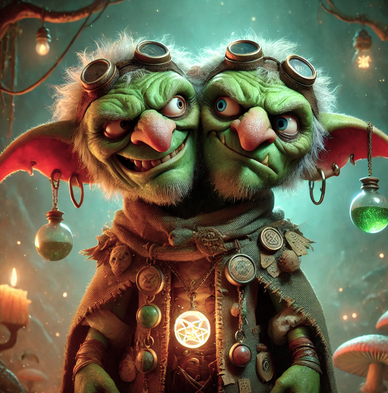

type:: [[NPC]]
in:: anywhere
icon:: 👤
description:: Verrückte Alchemisten
status:: 🫨

- **Race:** Goblin (Mutated, Two-Headed)
  **Class (if relevant):** Artificer (Alchemist)
  **Alignment:** *Chaotic Neutral*
  **Location:** *Wherever the wind, coin, or curses blow.*
  **Reputation:** Known in whispers as *“The Split Whisperer”* or *“Double-Dose”*
- {:height 401, :width 388}
- ---
- ### 🧪  **Their Potion Carriage – “The Rolling Remedy”**
  
  Imagine a crooked, half-wagon, half-laboratory trundling through the mist. A crooked shingled roof made from salvaged tavern signs, bones carved into racks for bottles, and glowing runes stitched across the canvas drapes. Bright blue smoke curls from a chimney made of stitched-together horns, and every time a wheel creaks, it lets out a faint giggle—or scream. The inside smells like lavender, swampwater, and arcane ink.
  
  At night, enchanted lanterns flicker with ghostly green light, and the side folds open to reveal shelves *dripping* with potions of all hues—some bottled in teeth, others in crystal, one even in what looks like an eyeball.
  
  ---
- ### 🧠  **Skrig & Blarn – The Goblin(s) Themselves**
  
  Two heads. One body. A thousand disagreements.
- **Skrig** (left head): Calculating, silver-tongued, always squinting and sneering. Loves rare poisons and prides himself on “precision alchemy.” Hates children.
- **Blarn** (right head): Madcap giggler. Wild ideas, wilder brews. Inventor of potions like *"Bottle o’ Boom"* and *"Mimic Juice."* Constantly talks to insects.
  
  They bicker constantly—loudly—and each claims to brew the better half of any potion sold.
  
  They wear a shredded patchwork robe, patched together with labels from past brews, and a belt lined with corks. Around their neck hangs a glass orb that always glows a different color depending on who’s talking.
- ### 🎭 Secrets (You Might Discover...)
- **Skrig and Blarn weren't always goblins.** Something happened in a ruined alchemy guild long ago. A single accident—or ritual—bound two souls into one mutated body.
- **Their carriage is *alive*.** It chooses where to go, and sometimes... it chooses *who* to follow.
- **They’re hiding a third head.** Somewhere. Somewhere very *close*.
- **They’re being hunted.** An ex-lover, or maybe a former guildmaster—no one’s sure—but a mysterious figure keeps turning up, one town behind.
- **Their rarest potion—rumored to grant a second life—is actually made from a piece of their own soul.**